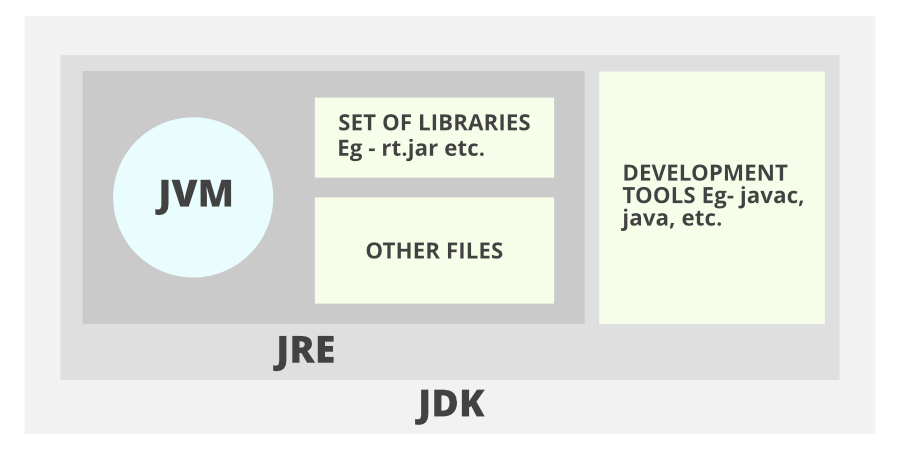

# JDK vs JRE vs JVM

1. **JDK** (Java Development Kit) is a Kit that provides the environment to develop and execute(run) the Java program.
   JDK is a kit(or package) that includes two things

    - Development Tools(to provide an environment to develop your java programs)
    - JRE (to execute your java program).

2. **JRE** (Java Runtime Environment) is an installation package that provides an environment to only run(not develop)
   the java program(or application)onto your machine. JRE is only used by those who only want to run Java programs that
   are end-users of your system.

3. **JVM** (Java Virtual Machine) is a very important part of both JDK and JRE because it is contained or inbuilt in
   both. Whatever Java program you run using JRE or JDK goes into JVM and JVM is responsible for executing the java
   program line by line, hence it is also known as an **interpreter**.

> Java applications are called **WORA (Write Once Run Anywhere)**. This means a programmer can develop Java code on one
> system
> and can expect it to run on any other Java-enabled system without any adjustments. This is all possible because of
> JVM.`

# Java SE vs EE vs ME vs FX

**Java SE** - Core Java  
**Java EE** - Built on top of Java SE for large scale development  
**Java ME** - Subset of Java SE for small device(like mobiles) applications  
**Java FX** - To develop GUI based lightweight applications
