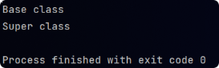

# Significance of super keyword

- JVM firstly looks for a method or attribute in the base class only, unless super keyword is used.
- `super` keyword is used to access properties of parent class.

```java

public static void main(String[]args){
        Audi audi=new Audi();
        audi.superDemo();
        }

public static class Car() {

    public void demo() {
        System.out.println("Super class");
    }
}

public static class Audi() extends Car {

    private void superDemo() {
        demo();
        super.demo();
    }

    @Override
    public void demo() {
        System.out.println("Base class");
    }
}
```

