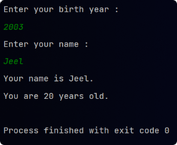

# Enter Key issue

```java
public static void main(String[]args){
        Scanner sc=new Scanner(System.in); // scanner object

        System.out.println("Enter your birth year : ");
        int birthYear=sc.nextInt();
        int age=LocalDateTime.now().getYear()-birthYear;
        // Hitting enter after any number input acts as a next line
        // Which is then captured by sc.nextLine()
        // Resulting into name = {Enter key}

        System.out.println("Enter your name : ");
        String name=sc.nextLine();

        System.out.println("Your name is "+name+".");
        System.out.println("You are "+age+" years old.");
        }
```


# [Solved] Enter key issue

```java
public static void main(String[]args){
        Scanner sc=new Scanner(System.in); // scanner object

        System.out.println("Enter your birth year : ");
        int birthYear=sc.nextInt();
        int age=LocalDateTime.now().getYear()-birthYear;

        sc.nextLine(); // to capture enter key (after entering integer)

        System.out.println("Enter your name : ");
        String name=sc.nextLine();

        System.out.println("Your name is "+name+".");
        System.out.println("You are "+age+" years old.");
        }
```


