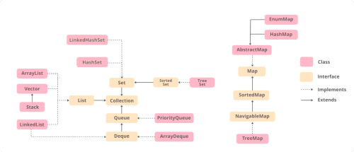

# Collections in Java

- Any group of individual objects which are represented as a single unit is known as the collection of the objects.

### What is a framework?

A framework is a set of **classes** and **interfaces** which provide a ready-made architecture.

### Collection framework

- Introduced in JDK 1.2
- Two root interfaces
	- `java.util.Collection` - Collection interface
	- `java.util.Map` - Map interface

[ Collection API Documentation](https://docs.oracle.com/javase/8/docs/api/java/util/Collection.html)