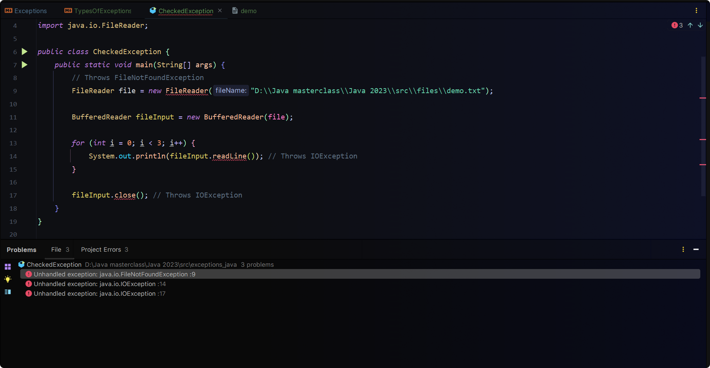

# Checked exceptions



1. Handling using `throws` keyword

```java
public class CheckedException {
    public static void main(String[] args) throws IOException {
        // Throws FileNotFoundException
        FileReader file = new FileReader("D:\\Java masterclass\\Java 2023\\src\\files\\demo.txt");

        BufferedReader fileInput = new BufferedReader(file);

        for (int i = 0; i < 3; i++) {
            System.out.println(fileInput.readLine()); // Throws IOException
        }

        fileInput.close(); // Throws IOException
    }
}
```

> Only specifying `IOException` is valid because `FileNotFoundException` is a subclass of `IOException` and is covered
> by it.

2. Handling using `try-catch` block

- Suitable method because of meaningful error messages

```java
public class CheckedException {
    public static void main(String[] args) {
        // Throws FileNotFoundException
        FileReader file = null;
        try {
            file = new FileReader("D:\\Java masterclass\\Java 2023\\src\\files\\demo.txt");
        } catch (FileNotFoundException e) {
            System.out.println("Invalid file path : " + e);
        }

        BufferedReader fileInput = new BufferedReader(file);

        for (int i = 0; i < 3; i++) {
            try {
                System.out.println(fileInput.readLine()); // Throws IOException
            } catch (IOException e) {
                System.out.println("Invalid file input : " + e);
            }
        }

        try {
            fileInput.close(); // Throws IOException
        } catch (IOException e) {
            System.out.println("Error occurred : " + e);
        }
    }
}
```