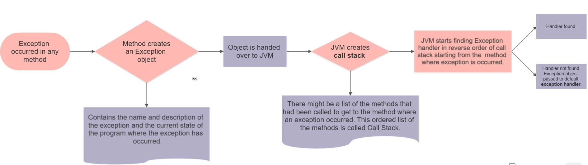

## Exception handling by JVM



```java
public class UncheckedException {
    public static void main(String[] args) {
        nullPointer(); // ArithmeticException
        invalidIndex(); // ArrayIndexOutOfBoundsException

        try {
            nullPointer();
        } catch (Exception e) {
            System.out.println("Custom message : " + e);
        }
    }

    static void nullPointer() {
        int x = 35 / 0; // No exception until method is called
        System.out.println(x);
    }

    static void invalidIndex() {
        int[] a = {1, 2, 3, 4, 5};
        System.out.println(a[7]); // No exception until method is called
    }
}
```

- Default handler output

```
Exception in thread "main" java.lang.ArithmeticException: / by zero
	at exceptions_java.UncheckedException.nullPointer(UncheckedException.java:16)
	at exceptions_java.UncheckedException.main(UncheckedException.java:5)

Process finished with exit code 1
```

- Custom handler output

```
Custom message : java.lang.ArithmeticException: / by zero

Process finished with exit code 0
```

## Exception handling by programmer

> `finally block` always gets executed, but the code after that is only executed when potential exception is handled and
> run-time error is not thrown.


