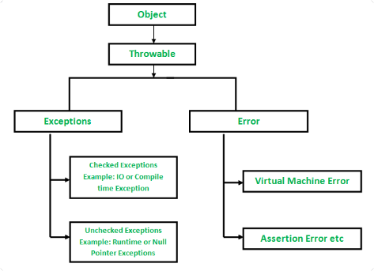

# Exceptions

- Exception is an unwanted or unexpected event, which occurs during the execution of a program, i.e. at **run time**,
  that disrupts the normal flow of the program’s instructions.

- When an exception occurs within a method, it creates an object. This object is called the `exception object`. It
  contains information about the exception, such as the name and description of the exception and the state of the
  program when the exception occurred.

### Major reasons why an exception Occurs

* Invalid user input
* Device failure
* Loss of network connection
* Physical limitations (out of disk memory)
* Code errors
* Opening an unavailable file

### Difference between errors and exceptions

Errors are serious problems which a reasonable application should not try to catch, while exceptions are conditions that
might be caught.

### Exception hierarchy

