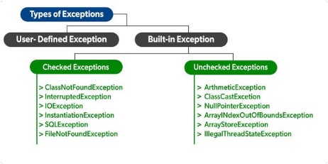

# Types of exceptions

## Checked Exceptions

- Not handling them causes compile-time errors
- It has two types:
	- Fully checked exceptions - All subclasses are checked
	- Partially checked exceptions - Some subclasses are unchecked

> `Throwable` and `Exception` are only available partially checked exceptions in java.

## Unchecked Exceptions

- These exceptions are not checked while compiling

> The `RuntimeException` class is able to resolve all the unchecked exceptions because of the child-parent relationship.

<table class="alt">
<tbody><tr>
<th>S.No</th>
<th>Checked Exception</th>
<th>Unchecked Exception</th>
</tr>
<tr>
<td>1.</td>
<td>These exceptions are checked at compile time. These exceptions are handled at compile time too.</td>
<td>These exceptions are just opposite to the checked exceptions. These exceptions are not checked and handled at compile time.</td>
</tr>
<tr>
<td>2.</td>
<td>These exceptions are direct subclasses of exception but not extended from RuntimeException class.</td>
<td>They are the direct subclasses of the RuntimeException class.</td>
</tr>
<tr>
<td>3.</td>
<td>The code gives a compilation error in the case when a method throws a checked exception. The compiler is not able to handle the exception on its own.</td>
<td>The code compiles without any error because the exceptions escape the notice of the compiler. These exceptions are the results of user-created errors in programming logic.</td>
</tr>
<tr>
<td>4.</td>
<td>These exceptions mostly occur when the probability of failure is too high.</td>
<td>These exceptions occur mostly due to programming mistakes.</td>
</tr>
<tr>
<td>5.</td>
<td>Common checked exceptions include IOException, DataAccessException, InterruptedException, etc.</td>
<td>Common unchecked exceptions include ArithmeticException, InvalidClassException, NullPointerException, etc.</td>
</tr>
<tr>
<td>6.</td>
<td>These exceptions are propagated using the throws keyword.</td>
<td>These are automatically propagated.</td>
</tr>
<tr>
<td>7.</td>
<td>It is required to provide the try-catch and try-finally block to handle the checked exception.</td>
<td>In the case of unchecked exception it is not mandatory.</td>
</tr>
</tbody></table>

