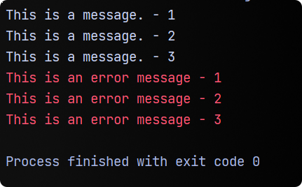
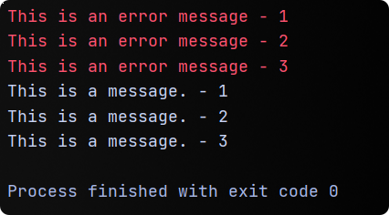
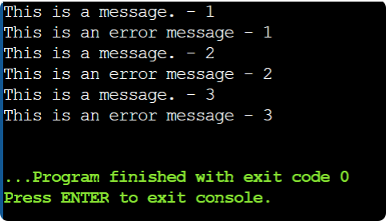

# Java IO streams

- Java brings various Streams with its I/O package that helps the user to perform all the input-output operations.
- These streams support all the types of objects, data-types, characters, files etc. to fully execute the I/O
  operations.

### Standard IO streams

1. `System.in` - To take inputs
2. `System.out` - To display result(output) on the screen
3. `System.err` - To display error messages (generally in _red_ color)

> `print()` keeps the cursor on the same line after printing output, whereas `println()` moves the cursor to the next
> line. However `printf()` is generally used to print formatted outputs.

## Difference between `out` and `err`

- Both are output streams of type `PrintStream` class and both are displayed on the console only.

- Although, both are different streams and both holds the output in different `Buffer`.

> `Buffer` is a **memory block** where all the output strings are hold before displaying the output.

### A great example

```java
public class Streams {
    public static void main(String[] args) {
        System.out.println("This is a message. - 1");
        System.out.flush();
        System.err.println("This is an error message - 1");
        System.err.flush();
        System.out.println("This is a message. - 2");
        System.out.flush();
        System.err.println("This is an error message - 2");
        System.err.flush();
        System.out.println("This is a message. - 3");
        System.out.flush();
        System.err.println("This is an error message - 3");
        System.err.flush();
    }
}
```

> Here `flush()` method is used to flush the buffer(i.e. release the hold data) of the particular stream.

- The output of the above code block can be either of the following:

<span>


</span>

- Our intention in above program is to print the messages in the same order as the code is written, that is why we
  used `flush()` method after every statement in order to create a new `Buffer`. (However the output will be same even
  if buffers are not flushed)

**Reason :** <br>
If the messages were printed in order then, for every statement JVM will have to create a new buffer to hold the
statement and then print it. But, **_JVM is smart._**

Here's what is interprets:

```java
public class Streams {
    public static void main(String[] args) {
        System.out.println("This is a message. - 1");
        System.out.println("This is a message. - 2");
        System.out.println("This is a message. - 3");
        System.err.println("This is an error message - 1");
        System.err.println("This is an error message - 2");
        System.err.println("This is an error message - 3");
        System.out.flush();
        System.err.flush();
    }
}
```

In this case, JVM creates just two buffers and gathers normal messages and error messages in each buffer and then prints
them.

> The order of `out` and `err` can not be verified.

**Expected output :**
<br>

<br>
How did this happen then? Well, this is the output from an online compiler which does not use JVM but aa java compiler.


