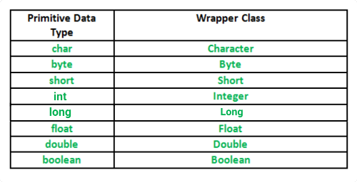

# Wrapper class

- A Wrapper class is a class whose object wraps or contains primitive data types.

### Need of Wrapper Classes

- They convert primitive data types into objects. Objects are needed if we wish to modify the arguments passed into a
  method (because primitive types are passed by value).
- The classes in java.util package handles only objects and hence wrapper classes help in this case also.
- Data structures in the Collection framework, such as ArrayList and Vector, store only objects (reference types) and
  not primitive types.
- An object is needed to support synchronization in multithreading.



### Autoboxing and unboxing

- **Autoboxing** : Converting primitive data type into an object
- **Unboxing** : Converting object into primitive data type

```java
        Integer myInteger=7; // new Integer(7); -- AUTOBOXING
        int myInt=myInteger; // myInteger.intalue(); -- UNBOXING
```