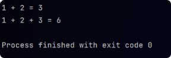
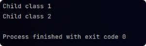

# Polymorphism

### Compile-time polymorphism (static)

- It occurs due to **method overloading**.

```java
public class Polymorphism {
    public static void main(String[] args) {

        // Compile-time polymorphism
        // Method is identified at compile-time with the help of parameter signatures
        System.out.println("1 + 2 = " + Parent.sum(1, 2));
        System.out.println("1 + 2 + 3 = " + Parent.sum(1, 2, 3));
    }
}

class Parent {
    public static int sum(int a, int b) {
        return a + b;
    }

    public static int sum(int a, int b, int c) {
        return a + b + c;
    }
}
```



### Run-time polymorphism (dynamic method dispatch)

- It occurs due to **method overriding**.

```java
public class Polymorphism {
    public static void main(String[] args) {

        // Run-time polymorphism
        Parent c1 = new Child1();
        c1.dynamic();
        c1 = new Child2();
        c1.dynamic();
    }
}

class Parent {
    public void dynamic() {
        System.out.println("Parent class");
    }
}

class Child1 extends Parent {
    @Override
    public void dynamic() {
        System.out.println("Child class 1");
    }
}

class Child2 extends Parent {
    @Override
    public void dynamic() {
        System.out.println("Child class 2");
    }
}
```

