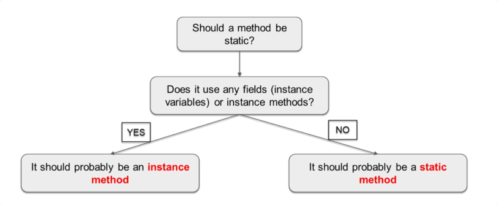

# Static vs Instance methods

- Static methods belong to whole class rather than a particular instance.
- Instance methods are associated with particular instance of the class.

> Static methods can be accessed via both class and instance of the class, whereas instance methods can only be accessed
> via an instance.



```java
public class StaticVsInstanceMethods {
    public static void main(String[] args) {
        Demo demo = new Demo();
        demo.method1();
        demo.method2();

        Demo.method1();
        // Demo.method2(); error
    }

    static class Demo {
        public static void method1() {
            System.out.println("This is a static method.");
        }

        public void method2() {
            System.out.println("This is an instance method.");
        }
    }
}
```

> Static methods can only be accessed or declared in a static scope.